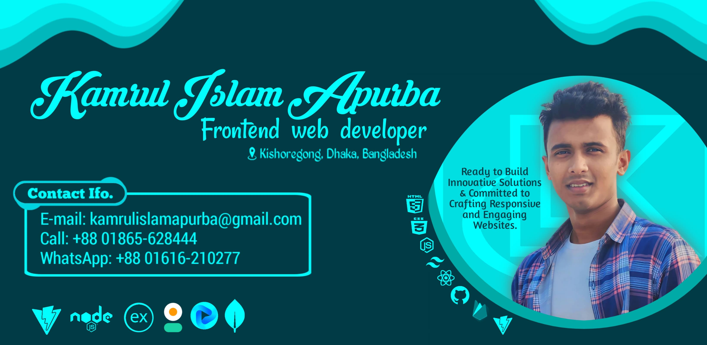

  
  
  
  

  

###

<h1 align="center">Hi, I'm Kamrul Islam Apurba 👋</h1>

###

<h3 align="center">👩‍💻  About Me</h3>

###

I'm Kamrul Islam Apurba, from Kishoreganj, Dhaka, Bangladesh.😊
 - 📧 Email: kamrulislamapurba@gamil.com 
 - 📞 Phone: +8801616210277 (+Whatsapp)
  
I'm a passionate frontend developer with a strong interest in building beautiful, user-friendly web applications.🌍
I specialize in modern tools like:
  - HTML,
  - CSS,
  - Javascript,
  - Node.js,
  - ExpressJs,
  - React,
  - Tailwind CSS,
  - mongoDB,
  - Firebase etc.
  to create engaging, responsive designs that bring ideas to life.👍
  When I'm not coding, I enjoy exploring new technologies, learning new skills, and challenging myself to grow both personally and professionally.😇

###

<h4 align="left">📌 Current Activities</h4>

###

- 🚀 Exploring Next.js and enhancing my frontend development skills.
- 🏗️ Working on a Tech Hunt Web.
- 📝 Learning about web performance optimization.

###

<h3 align="center">Let’s create something amazing together!💕💕</h3>

###

# 🛠️ Tech Stack  

## 🚀 Frontend  

  
  
  
  
  
  
  
  

## ⚙️ Backend & Database  

  
  
  

## 🛠️ Tools & Others  

  
  
  
  

---

✨ **This stack ensures high performance, maintainability, and a seamless user experience.** 🚀

   

<h2 align="center">🔥   My Stats :</h2>

###

 

  
  
  
  
  
  
  

###

 

  

###
  
<h2 align="center">⭐ Feel free to explore my repositories and drop a star if you find something interesting! ⭐</h2>
